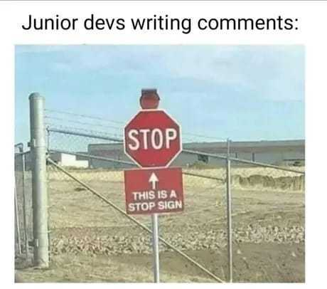
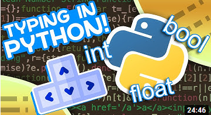
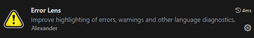

# Clean Code

Let's continue our journey to write better code. In this module we will focus on the how to write comments and name things. Naming things is one of the hardest things in programming, and it's also one of the most important. We will also learn how to add type hints to our code, and how to use a static type checker.

## Uncle Bob - Clean code lesson 2 (1:06)

[Link to video](https://www.youtube.com/watch?v=2a_ytyt9sf8)

In the second part of the "Coding Better World Together", Uncle Bob focuses on the clean code rules for comments and rules to write names.

After this lesson you should:

- Understand what kinds of comments to write,
- Know about _lying comments_ and when _not_ to write comments,
- Be able to reveal your intent while naming things.

## Python Type Checking (Guide) (1:00)

[Link to video](https://youtu.be/QORvB-_mbZ0)

In this video, Tim explains what are type hints. The explanations are very clear and concise, and he also shows how to use them in your code.
Type hints are optional in Python, but using them will allow you to catch bugs before they happen, and allow readers to understand your classes and functions just by looking at their signatures.

After this lesson you should:

- Learn how to add type hints to your code,
- Be able to create type aliases,
- Know how to run a static type checker like `mypy`.

> **Notes**:
> >
> - The `Optional[X]` type is a shorthand notation for `Union[X, None]`, where `X` is your argument type. It can be used whenever you wish to indicate that a value can be `None` or of type `X`.
> - Ever since [Python 3.10](https://peps.python.org/pep-0604/) you can also use the `|` operator to indicate unions, so `Optional[X]` is also equivalent to `X | None`.
> - Since [Python 3.9](https://docs.python.org/3/whatsnew/3.9.html#type-hinting-generics-in-standard-collections) we are no longer required to import `List` and `Dict` from the `typing` module. Instead we can use `list` and `dict` as a type hint directly, just as we use `int`, `str`, and `bool`. So Tim's `List[List[int]]` example can now be written as `list[list[int]]` instead.

Nowadays, VSCode usually comes with a type checked installed by default. But the button to activate is easy to miss. If you have a type checker installed, you should see a button like this one on the bottom bar of your VSCode window:

Now you should see the errors and warnings in your code in the "Problems" tab (it sits next to your integrated terminal window). Personally, I like to use the [Error Lens](https://marketplace.visualstudio.com/items?itemName=usernamehw.errorlens) add-on to make the errors and warnings more visible:

## Extra resources

- [Virtual environments](virtual_environments.md) - If you are curious about how virtual environments work, you should definitely see this article from RealPython.
