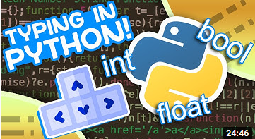

# Clean Code

> **Note**: The videos in this module are quite long, so we suggest you watch the first one on the first week and the second one on the second week.

People who write code are often not the same people who maintain it. Trying to understand an unfamiliar codebase to fix a bug in production is already stressful enough, but trying to understand _badly written_ code is even worse.

  

Code is read more often than it is written, so we should always write our code thinking about the person who will eventually read it - even when that person turns out to be you. Being able to return to previously written code and understand what it does is key, especially in the software development world.

This module focuses on the principles of clean code, and how to apply them to your own code. But before you dive into that, let's take a look at some common mistakes and the issues they might cause.

## 7 Python Code Smells (0:22)

[Link to video](https://www.youtube.com/watch?v=LrtnLEkOwFE)

This video shows 7 code smells that point to poor design decisions, as well as how to fix them. It's a very practical video, that uses actual Python code and a good way to close this module.

After this lesson you should:

- Have a better idea of things to look out for when reviewing other people' codes. But we will cover more ground in the following modules.

---

Alright! So now that you have a better idea of what to look out for, let's dive into the principles of clean code.

## Uncle Bob - Clean code lesson 1 (1:48)

[Link to video](https://www.youtube.com/watch?v=7EmboKQH8lM)

Robert "Uncle Bob" Martin is one of the icons of the industry and one of the authors of the Agile Manifesto. In this first part of the "Coding Better World Together", he explain what is clean code, why it matters, and establishes the bases to achieve it.

After this lesson you should:

- Understand what clean code is,
- Learn how to start refactoring your current codebase,
- Antipatterns to avoid.

## Uncle Bob - Clean code lesson 2 (1:06)

[Link to video](https://www.youtube.com/watch?v=2a_ytyt9sf8)

In the second part of the "Coding Better World Together", Uncle Bob focuses on the clean code rules for comments and rules to write names.

After this lesson you should:

- Understand what kinds of comments to write,
- Know about _lying comments_ and when _not_ to write comments,
- Be able to reveal your intent while naming things.

## Python Type Checking (Guide) (0:25)

[Link to video](https://youtu.be/QORvB-_mbZ0)

In this video, Tim explains what are type hints. The explanations are very clear and concise, and he also shows how to use them in your code.
Type hints are optional in Python, but using them will allow you to catch bugs before they happen, and allow readers to understand your classes and functions just by looking at their signatures.

After this lesson you should:

- Learn how to add type hints to your code,
- Be able to create type aliases,
- Know how to run a static type checker like `mypy`.

> **Note**: The `Optional[X]` type is a shorthand notation for `Union[X, None]`, where `X` is your argument type. It can be used whenever you wish to indicate that a value can be `None` or of type `X` If Ever since [Python 3.10](https://peps.python.org/pep-0604/) you can also use the `|` operator to indicate unions, so `Optional[X]` is also equivalent to `X | None`.

> **Note**: Ever since [Python 3.9](https://docs.python.org/3/whatsnew/3.9.html#type-hinting-generics-in-standard-collections) we are no longer required to import `List` and `Dict` from the `typing` module. Instead we can use `list` and `dict` as a type hint directly, just as we use `int`, `str`, and `bool`. So Tim's `List[List[int]]` example can now be written as `list[list[int]]` instead.
